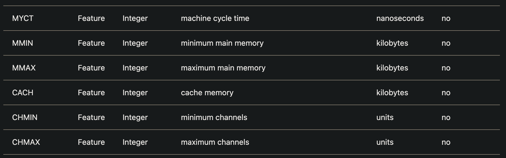
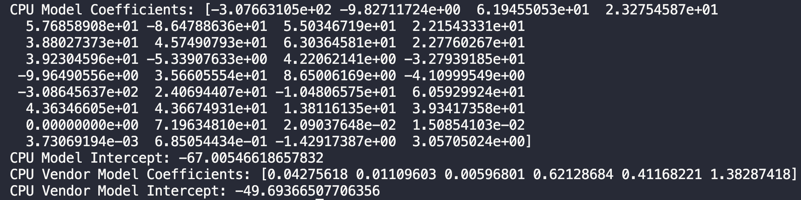
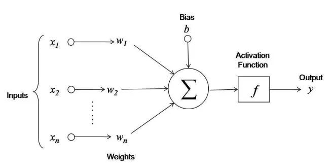
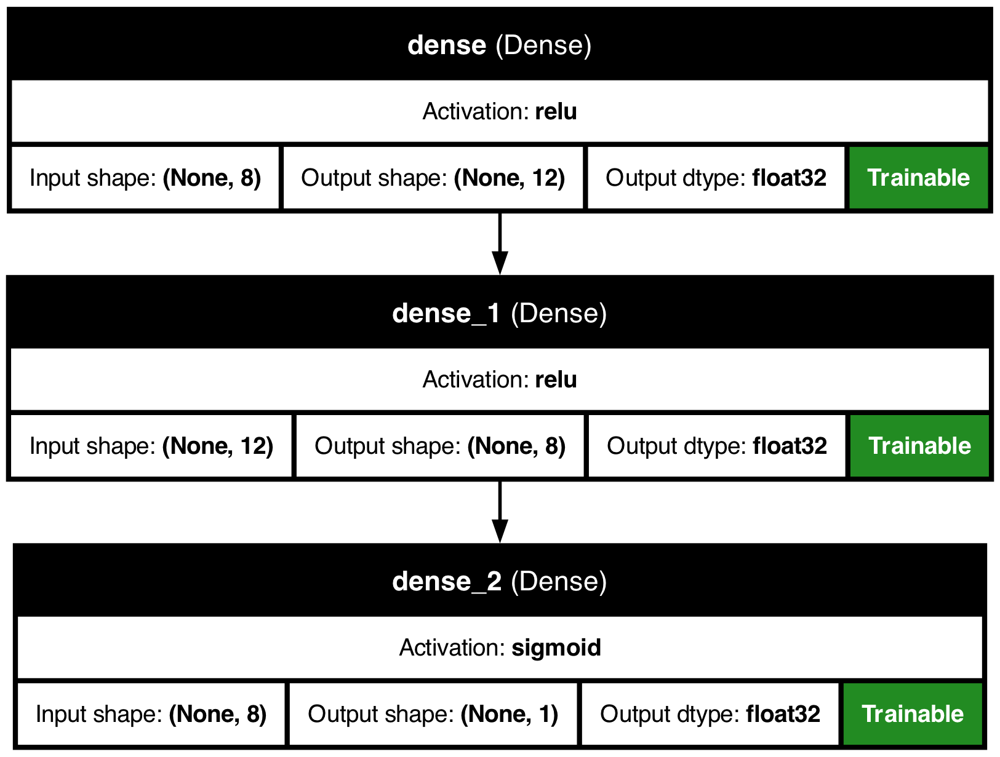
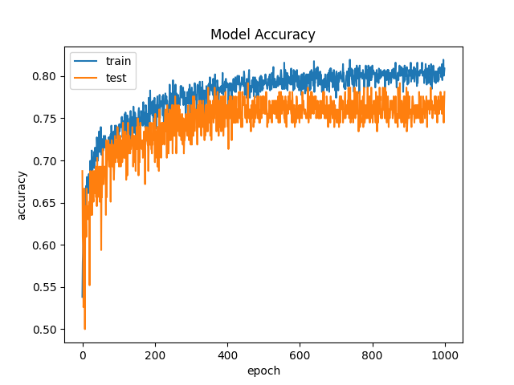

# Part 0 - How to
The below is a report for Into to AI classes. The README file is the answers to all questions from the google colab. Besides there is python code for each part. To replicate the results simply run any file of interest in your favourite IDE. 

## DATASETS 
All datasets used are in the DATASETS directory. They are available [here](https://scikit-learn.org/stable/datasets.html).

## contents
In the contents directory, the generated trees and curves are located, but if you run certain files, the images will generate again.

# Part 1 - Reviewing Questions
## Questions
1. What are the differences between supervised, unsupervised, and reinforcement learning?
2. How is regression different from classification?
3. What are linear regression, decision tree, and neural network?
4. What is the test set, and what is the training set?
5. What is _overfitting_, and what is _underfitting_?
6. How to deal with _overfitting_ for linear regression, decision trees, and neural networks?
7. What is Exploratory Data Analysis (EDA), and why do we do it?
8. What is an _outlier_?
9. What metrics can be used to measure the model's performance in supervised learning, and what is their interpretation?
10. What is cross-validation?

## Answers
1. Supervised, unsupervised, and reinforcement learning are three primary types of machine learning, each with distinct characteristics. **Supervised learning** uses labeled datasets to train models that predict outcomes, making it suitable for classification and regression tasks. In contrast, **unsupervised learning** works with unlabeled data to discover hidden patterns or groupings, commonly applied in clustering and association problems. **Reinforcement learning** involves an agent learning through trial and error by interacting with an environment, receiving rewards for "job well-done" and penalties when it's wrong based on the ideal outcome defined.
2. Both **regression** and **classification** are techniques of **supervised** learning. **Regression** simply recognizes patterns and predicts future data based on the relationship between inputs and outputs. It's used for continuous numerical values. On the other hand **classification** aims to assign values to predefined categories. The data is discrete, and can be grouped. In both cases the data used is labeled, but both techniques use this for their different purposes.
3. **Linear regression** is a statistical method of fitting data into a linear equation. It is used for predicting outcomes of continuous data. **Decision tree** is a supervised learning algorithm which operates in a hierarchal structure of nodes and vertices. It can be used for both **regression** and **classification** techniques. They operate based on decisions which are represented by **decision nodes** and lead to outcomes represented by **leaf nodes**. The last term **Neural Networks** describes a model structured from interconnected layers of nodes (called **neurons**). In this model each neuron processes the input and passes it through an activation function to determine outputs. The data does not need to be linear and the model is effective for e.g. natural language processing or image recognition.
4. The term **test set** relates to a subset of the original dataset on which the model **is not trained on**. It is used to evaluate the models effectiveness to adapt to new data and how well the model generalizes the new data. On the other hand the **training set** is the data subset used to train the ML model. The data is labeled and it helps the model in structuring connections between data. This dataset is the biggest and allows the model to substantially learn. 
5. **Overfitting** occurs when the model trains on data and receives too much noise, even if the connections in data are very strong. This leads to great performance in the **training set** data, but very poor one in new unseen data. It happens because the model "learns too well" and not only learns the actual patterns but noise also, which might not be present in the **test set**. **Underfitting** on the other hand is when the model trains poorly on the data and does not capture the trends underlying in the data. If the model is underfit for the job, then it fails to learn sufficiently to perform well even on the **training data**. Underfitting might happen due to not enough training time or insufficient complexity of the model.
6. To combat overfitting for **linear regression**, a popular method are **regularization techniques**. They essentially add penalty to the coefficients which limits the complexity of the model. We could also employ **cross-validation**, which is about dividing the set into smaller subsets so that the training data is fully different from the testing data. For **decision trees** - **pruning** could be a good idea. It involves getting rid of sections of the tree that are not essential to predictions. It could be done before the tree grows (stopping growth on certain parts during creation) or by trimming a grown tree. In **neural networks** to combat **overfitting** we could use **dropout** which makes some of the neurons **disappear** to prevent reliance on specific nodes. We could also implement early stopping, which is about stopping the training when the validation set performance begins to degrade.
7. **Exploratory Data Analysis (EDA)** is a process in data analysis that involves visualizations to summarize and explore datasets. The primary goal of EDA is to understand the data's main characteristics, identify patterns, spot anomalies, and test hypotheses without making prior assumptions. 
8. An outlier is a data point that significantly deviates from the other observations in a dataset, either being much higher or lower than the majority of values. Outliers can result from measurement variability, errors, or may indicate important phenomena.
9. There are many metrics to **measure the performance** of a certain model. We can measure **accuracy** of the model to know the proportion of correctly predicted data in the whole dataset. We could also implement a **confusion matrix** to break down the predictions into four categories: *True Positives, False Positives, True Negatives*, and *False Negatives*. We could potentially also observe the **precision** of the model so how accurate the model is when making a positive prediction. It is calculated as a ratio of true positives to the sum of true and false positives.
10. explained in point 6.

# Part 4 - EDA 
## 1.
Number of rows: 6 <br>
Number of columns: 7 

## 2.
There are 7 variables in the dataset sky, airTemp, humidity, wind, water, forecast, enjoy. Among them 6 are feature variables, without enjoy which depend on the other variables.

# 3. 
There are 6 instances. Among them, there are 4 (enjoy == yes) and 2 (enjoy == no)

## 4. 
The answer would be temperature, as every time the temperature is warm, the enjoy variable is always yes. And when the temperature is cool, the enjoy variable is always no.

## 5.
Number of items with humidity == 'high': 4
Indices of items with humidity == 'high': [1, 2, 3, 5]


# Part 5 - Linear Regression
## 1. What do the variables mean?

## 2. How do these datasets differ?
The cpu_vendor.csv has information on the vendors places in the first column. So it also has one more column (more variables).
## 3. What type is the vendor and class data series?
`vendor => object` <br>
`class => int64 (integer)`
## 4. String cannot be used in linear regression.
When using `df['vendor'] = pd.get_dummies(df['vendor'])` we get an Error. In my case I have used concat to properly attach the 'dummyfied' vendor column to the dataset.
## 5. What are the differences in the scores of the models? What is the mathematical complexity of the models?
 The CPU model score is: 0.8806919151908303
 The CPU_Vendor score is: 0.8893455830696773
## 6. What are the coefficients of the regression equation?

# Part 6 - Decision Trees
The values *gini* and *entropy* are criteria meassureing the quality of decision tree split. Mathematically the **gini** index indicates how impure and mixed the data is. the value ranges between 0 and 1. The closer to 0 the purer the dataset is. On the other hand the **entropy** meassures the uncertainty and randomness. This index also ranges between 0 and 1, where 0 indicates all elements belonging to the same class.
<br/>
After dropping the airTemp column, we can observe on the *decision_tree2.png* how the tree diverges into more branches.
<br/>

### Feature and Threshold (X <= R):
This indicates the feature (X) and the threshold value (R) used to split the data at this node.
If the condition is true, the left child node is followed; otherwise, the right child node is followed.

### Entropy (gini/entropy = Y):
This shows the impurity measure (Gini impurity or entropy) at this node.
Lower values indicate purer nodes.

### Samples (samples = Z):
This indicates the number of samples (data points) that reach this node.

### Value (value = V):
This shows the distribution of samples among the classes at this node.
For example, value = [a, b] means there are a samples of class 0 and b samples of class 1.

## Explanation of Parameters

### max_depth:
This parameter specifies the maximum depth of the tree. Limiting the depth of the tree helps prevent overfitting.

### min_samples_split:
This parameter specifies the minimum number of samples required to split an internal node.

### min_samples_leaf:
This parameter specifies the minimum number of samples required to be at a leaf node.

# Part 7 - Neural Networks.
## Notes
Neural networks are a type ML framework that is based on how humans neurons work in our brains. Algorithms based on that technology are aiming to replicate the cognitive abilities of the human brain to recognize patterns and imporve predicitons. 
Structure of Neural Networks

## Layers:
- **Input Layer**: This is the first layer, where data enters the network. Each neuron in this layer represents a feature of the input data.
- **Hidden Layers**: These layers perform various transformations on the inputs received from the previous layer. The number of hidden layers can vary, and networks with multiple hidden layers are often referred to as deep neural networks
- **Output Layer**: This final layer produces the output of the network, which can be a classification label, a prediction, or other types of results based on the task at hand.

## Usage:
- Image Recognition
- Natural Language Processing (NLP)
- Predictive Modeling
- Reinforcement Learning

## Neurons 

Each neuron is constructed as such:



First each neuron sums up all of the calculations of previous neurons which were multiplied by different weights determined according to connections between neurons. After that the neuron uses an activation function $f(x)=1$ for $\sum w_i*x_i \geq 0$ or $f(x)=0$ for $\sum w_i*x_i < 0$.

## Visualisation

There are 3 layers in the architecture visualisation as seen in the image below:



The first two layers are the hidden layers and the last one signified by the 'sigmoid' keyword is the output layer.

### Batch Size
The **batch size** refers to the number of samples of the data that the model trains on. In our example the batch size is initialized to 16.

```python
BATCH_SIZE = 16
```
In the most basic sense, it means that the model will process 16 different samples of data before adjusting the weights.

### Epochs
Epochs refer to the number of passes through the entire dataset. In this example we use 1000 epochs.

```python
NB_EPOCHS = 1000
```
It means that the model will go through the training set 1000 times during the training.

# Part 8 - Validation
Below is the image generated from the NN model:



We can interpret that the model is doing just fine, as there is a big similarity between the training set and the test set.

After changing the metrics like Precision, Recall, AUC

```python
model.compile(loss='binary_crossentropy', optimizer='adam', metrics=['accuracy', Precision(), Recall(), AUC()])
```
We get different curves for these metrics. They can be observed [here](https://github.com/vpofg/IAI_colabTask/tree/main/contents/Curves).


